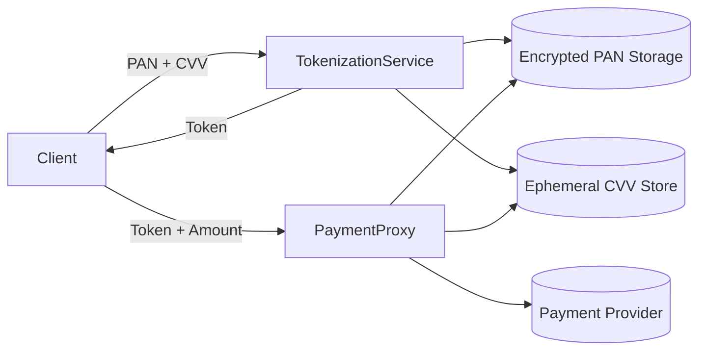
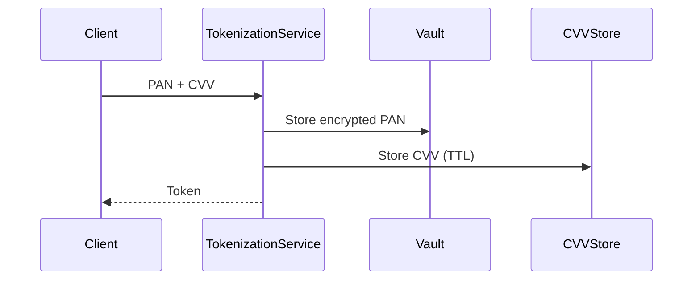
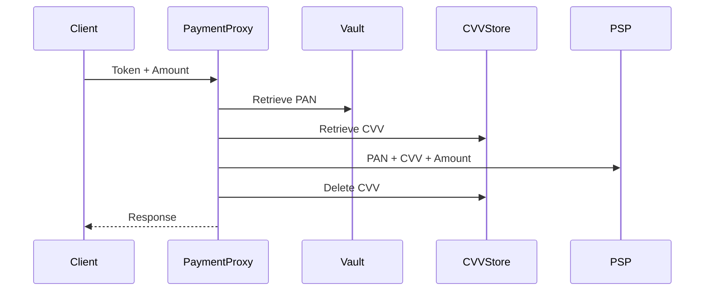

# PCI-Compliant Token Vault & Payment Proxy – Full Consolidated Specification

## 1. Overview
This document consolidates the full architecture, requirements, security controls, APIs, infrastructure, and threat model for a PCI DSS–aligned tokenization vault and payment proxy system.

---

## 2. Core Principles

- PAN must be encrypted at rest (AES-256-GCM)
- CVV must NEVER be persistently stored (PCI DSS Req 3.2)
- Tokenization must be irreversible outside the vault
- Strict CDE vs non-CDE segmentation
- Zero Trust architecture (mTLS, RBAC, least privilege)

---

## 3. Microservices Architecture



---

Below is a **formal, implementation-ready definition of Functional Requirements (FRs)** in English, aligned with your system design and explicitly reflecting:

> ✅ CVV is stored **ephemerally with a TTL of 1 hour**

---

## Functional Requirements

### FR-01 — PAN Tokenization

The system shall:

* Accept PAN, expiration date, and CVV as input
* Validate PAN format (including Luhn algorithm)
* Generate a **unique, non-reversible token**
* Encrypt and store the PAN in the vault
* Store the CVV in an **ephemeral storage with a TTL of 1 hour**

**Output:**

```json
{
  "token": "tok_xxx"
}
```

---

### FR-02 — Token Generation

The system shall generate tokens that are:

* Globally unique
* Non-deterministic
* Not mathematically or logically derivable from the PAN

---

## 2. Secure Storage

### FR-03 — PAN Persistence

The system shall:

* Store PAN only in encrypted form
* Associate each PAN with a token
* Maintain metadata (creation time, last usage, status)

---

### FR-04 — CVV Ephemeral Storage

The system shall:

* Store CVV in ephemeral storage (e.g., in-memory or Redis)
* Associate CVV with the corresponding token
* Apply a **TTL of 1 hour**
* Automatically delete CVV after:

  * TTL expiration, or
  * First successful usage (whichever occurs first)

---

## 3. Controlled Detokenization

### FR-05 — PAN Retrieval

The system shall:

* Allow retrieval of PAN only via the Payment Proxy
* Prevent direct access to PAN from any external service or client

---

### FR-06 — CVV Retrieval

The system shall:

* Retrieve CVV associated with a token if it exists and is not expired
* Reject requests if CVV is unavailable or expired
* Delete CVV immediately after retrieval

---

## 4. Payment Processing

### FR-07 — Token-Based Payment Processing

The system shall:

* Accept a token and payment details (amount, currency)
* Resolve token → PAN
* Retrieve CVV (if available)
* Submit PAN + CVV + payment data to a payment provider such as Stripe or Adyen
* Return the payment result to the caller

---

### FR-08 — Error Handling

The system shall handle and return structured errors for:

* Invalid or unknown token
* Expired or missing CVV
* Payment provider errors
* Internal system failures

---

## 5. Token Management

### FR-09 — Token Validation

The system shall:

* Validate token existence
* Validate token status (active/inactive)
* Reject invalid or revoked tokens

---

### FR-10 — Token Lifecycle Management

The system shall:

* Support logical deactivation of tokens
* Prevent usage of inactive tokens in payment operations

---

## 6. Audit and Traceability

### FR-11 — Operation Logging

The system shall log:

* Tokenization requests
* Detokenization attempts
* Payment processing events
* Access attempts (successful and failed)

---

### FR-12 — Token Traceability

The system shall:

* Maintain a usage history per token
* Track last usage timestamp
* Enable traceability for audit purposes

---

## 7. Access Control

### FR-13 — Authentication

The system shall:

* Authenticate all clients and services interacting with the system
* Support service-to-service authentication

---

### FR-14 — Authorization

The system shall enforce:

* Role-based access control (RBAC)
* Restrictions on:

  * Tokenization operations
  * Detokenization operations
  * Payment execution

---

## 8. Reliability and Operations

### FR-15 — High Availability

The system shall:

* Support concurrent requests
* Maintain high availability for tokenization and payment flows

---

### FR-16 — Idempotency

The system shall:

* Support idempotency keys for payment operations
* Prevent duplicate payment processing

---

## 9. Configuration

### FR-17 — CVV TTL Configuration

The system shall:

* Allow configuration of CVV TTL
* Default TTL shall be **1 hour**

---

### FR-18 — Payment Provider Integration

The system shall:

* Support integration with one or more payment providers
* Allow configuration of provider endpoints and credentials

---

# 🧠 Key Design Interpretation

This system implements four core functional capabilities:

1. **Tokenize sensitive data (PAN + CVV intake)**
2. **Securely store PAN and transiently store CVV**
3. **Resolve tokens via controlled proxy**
4. **Execute payments using detokenized data**

---


## 4. Sequence Diagrams

### Tokenization Flow


### Payment Flow


---

## 5. Components

### Tokenization Service
- Validates PAN (Luhn)
- Generates secure token
- Encrypts PAN using AES-256-GCM
- Stores CVV in ephemeral store

### Vault Storage
- Stores encrypted PAN only
- Uses envelope encryption (DEK + KEK via KMS)

### CVV Store
- In-memory or Redis
- TTL ≤ 120 seconds
- Auto-delete after first use

### Payment Proxy
- Only component allowed to detokenize
- Decrypts PAN in memory
- Retrieves CVV
- Sends to payment provider
- Wipes memory after use

---

## 6. API Specification (OpenAPI)

### Tokenization
```yaml
POST /vault/tokenize
Request:
  pan: string
  expiry: string
  cvv: string

Response:
  token: string
```

### Payment Proxy
```yaml
POST /proxy/charge
Request:
  token: string
  amount: integer
  currency: string
```

---

## 7. Data Model

| Field | Description |
|------|------------|
| token | Alias |
| pan_ciphertext | Encrypted PAN |
| iv | Initialization vector |
| tag | Auth tag |
| dek_encrypted | Encrypted DEK |
| created_at | Timestamp |

---

## 8. Security Controls

### Cryptography
- AES-256-GCM (data at rest)
- TLS 1.2+ (in transit)
- Unique IV per record

### Key Management
- External KMS/HSM (AWS KMS recommended)
- Automatic rotation
- No keys stored in code

### Access Control
- mTLS between services
- RBAC enforced
- Least privilege

### Logging
- Mask PAN (e.g. 411111******1111)
- Never log CVV
- Centralized logging + SIEM

---

## 9. Compliance (PCI DSS)

| Requirement | Implementation |
|------------|---------------|
| Req 3 | Encryption + tokenization |
| Req 4 | TLS encryption |
| Req 7 | RBAC |
| Req 8 | Strong authentication |
| Req 10 | Logging and monitoring |
| Req 11 | Security testing |

---

## 10. Infrastructure (Terraform Example)

```hcl
resource "aws_kms_key" "vault_key" {
  description = "Vault encryption key"
}

resource "aws_vpc" "cde_vpc" {
  cidr_block = "10.0.0.0/16"
}
```

---

## 11. Threat Model (STRIDE)

| Threat | Mitigation |
|------|-----------|
| Spoofing | mTLS |
| Tampering | AES-GCM authentication |
| Repudiation | Audit logs |
| Information Disclosure | Encryption |
| DoS | Rate limiting |
| Privilege Escalation | RBAC |

---

## 12. Deployment

- Kubernetes recommended
- Namespaces:
  - cde-vault
  - cde-proxy
  - public-api
- Network policies enforced
- Private subnets for CDE

---

## 13. Hardening Checklist

- Key rotation enabled
- mTLS enforced
- Secrets stored securely (KMS/Secrets Manager)
- No sensitive data in logs
- Memory zeroization implemented
- WAF + rate limiting enabled
- Penetration testing completed

---

## 14. Summary

This system provides:
- Secure tokenization of PAN
- PCI-compliant ephemeral handling of CVV
- Controlled detokenization via proxy
- Strong cryptographic guarantees
- Production-ready architecture

